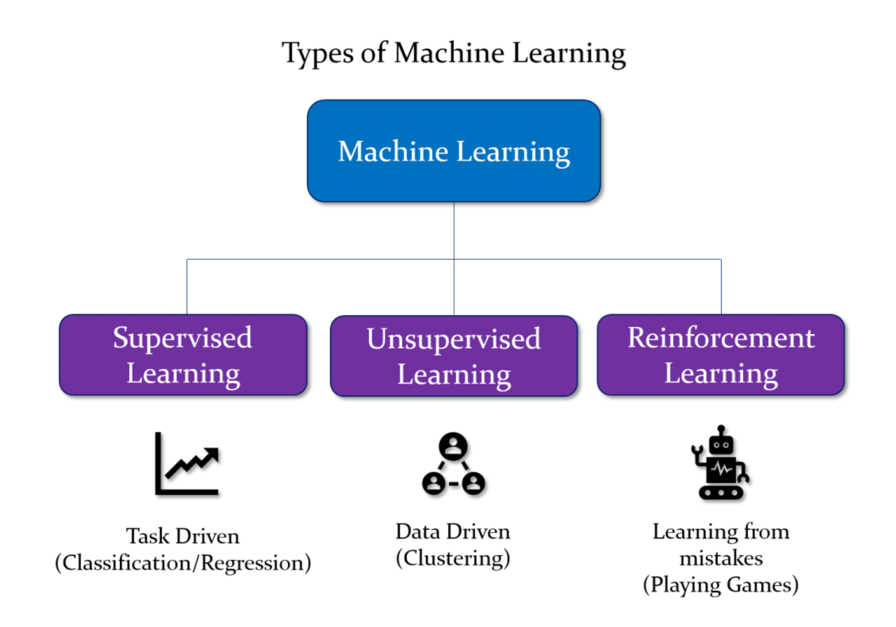
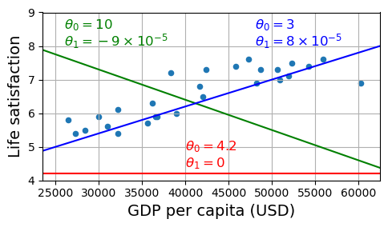
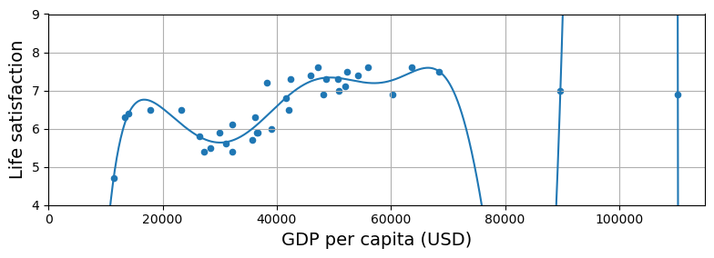

# **Feature Engineering**

## The Machine Learning Fundamentals

---

# What is machine learning?
Machine learning fits mathematical models to data in order to derive insights or make predictions. 

>[Machine Learning is the] field of study that gives computers the ability to learn without being explicitly programmed.
>    —Arthur Samuel, 1959

These models take **features** as input. A feature is a numeric representation of an aspect of raw data. 
<!--
Features are used as input variables in models that learn from data to make predictions or decisions without being explicitly programmed.
-->
---
# Feature engineering
Feature engineering is the act of extracting features from raw data and transforming them into formats that are suitable for the machine learning model. It is a crucial step in the machine learning pipeline, because the right features can ease the difficulty of modeling, and therefore enable the pipeline to output results of higher quality.

---
# Machine Learning is great for:
- Problems for which existing solutions require a lot of hand-tuning or long lists of rules: one Machine Learning algorithm can often simplify code and perform better.
- Complex problems for which there is no good solution at all using a traditional approach: the best Machine Learning techniques can find a solution.
- Fluctuating environments: a Machine Learning system can adapt to new data.
- Getting insights about complex problems and large amounts of data.

---
## The Machine Learning Pipeline

* **Data**: What we call data are observations of real-world phenomena. 
<!--
Each piece of data provides a small window into a limited aspect of reality. The collection of all of these observations gives us a picture of the whole. But the picture is messy because it is composed of a thousand little pieces, and there’s always measurement noise and missing pieces.
-->
* **Models**: A mathematical model of data describes the relationships between different aspects of the data. 
<!--
  For instance, a model that recommends music might measure the similarity between users (based on their listening habits), and recommend the same artists to users who have listened to a lot of the same songs.
  -->
* **Features**: A feature is a numeric representation of raw data. 
<!--
There are many ways to turn raw data into numeric measurements, which is why features can end up looking like a lot of things. Naturally, features must derive from the type of data that is available. 
-->

---

## The Machine Learning Pipeline

Some models are more appropriate for some types of features, and vice versa. The right features are relevant to the task at hand and should be easy for the model to ingest. 

**Feature engineering** is the process of formulating the most appropriate features given the data, the model, and the task.

---

## Types of Machine Learning Models




---

## Types of Machine Learning Models


---
# Types of Machine Learning Models


---

# The main steps of the machine learning pipeline

1. Look at the big picture.
2. Get the data.
3. Discover and visualize the data to gain insights.
4. Prepare the data for Machine Learning algorithms.
5. Select a model and train it.
6. Fine-tune your model.

---

## Example: Does money make people happier?

Let's predict the happiness level based on income.


---
## Example: Does money make people happier?
```python
# Select a linear model
model = LinearRegression()

# Train the model
model.fit(X, y)

# Make a prediction for Cyprus
X_new = [[37_655.2]]  # Cyprus' GDP per capita in 2020
print(model.predict(X_new)) # outputs [[6.30165767]]
```
---

## Example: Does money make people happier?

Replacing the Linear Regression model with k-Nearest Neighbors (in this example, k = 3) regression in the previous code is as simple as replacing a line of code:

```python
model = KNeighborsRegressor(n_neighbors=3)
# Train the model
model.fit(X, y)
# Make a prediction for Cyprus
print(model.predict(X_new)) # outputs [[6.33333333]]
```

---

## Overfitting

To illustrate the risk of overfitting, we use only part of the data in most figures (all countries with a GDP per capita between `min_gdp` and `max_gdp`). 

```python
min_gdp = 23_500
max_gdp = 62_500

country_stats = full_country_stats[(full_country_stats[gdppc_col] >= min_gdp) &
                                   (full_country_stats[gdppc_col] <= max_gdp)]
```

Later we reveal the missing countries, and show that they don't follow the same linear trend at all.

---
## Overfitting


---
## Model selection: a simple linear model

life_satisfaction = $\theta_0 + \theta_1 \times$ GDP_per_capita

This model is just a linear function of the input feature GDP_per_capita. $\theta_0$ and $\theta_1$ are the model’s parameters.

---
## Model selection: a simple linear model

More generally, a linear model makes a prediction by simply computing a weighted sum of the input features, plus a constant called the intercept term (or bias):
$$
\hat y = \theta_0 + \theta_1 x_1 + \theta_2 x_2 + \dots + \theta_n x_n
$$

In vectorized form:
$$
\hat y = \mathbf{\theta} \cdot \mathbf{x}
$$

---
## Model selection: a simple linear model




---
## Training the Model

>Training a model means setting its parameters so that the model best fits the training set. 

For this purpose, we first need a measure of how well (or poorly) the model fits the training data. The most common performance measure of a regression model is the Mean Square Error (MSE). 

---
## Training the Model
So, to train a Linear Regression model, you need to find the value of θ that minimizes the MSE.

The MSE of a Linear Regression hypothesis $h_θ$ on a training set $\mathbf{X}$ is calculated using:
$$
\mathrm{MSE}(X, h_θ) = \frac{1}{m} \sum_{i = 1}^{m} \big( \mathbf{\theta}^T \mathbf{x}^{(i)} − y^{(i)} \big)^2
$$

---
## The Normal Equation

To find the value of $\theta$ that minimizes the cost function, there is a closed-form solution —in other words, a mathematical equation that gives the result directly. 

This is called the *Normal Equation*:
$$
\mathbf{\hat \theta} = (\mathbf{X}^T\mathbf{X})^{−1} \mathbf{X}^T \mathbf{y}
$$

>However, The computational complexity of inverting such a matrix is typically about $O(n^{2.4})$ to $O(n^3)$ (depending on the implementation).

<!--
In other words, if you double the number of features, you multiply the computation time by roughly $2^{2.4} = 5.3$ to $2^3 = 8$.

Instead, the approach used by `Scikit-Learn`’s `LinearRegression` class is about $O(n^2)$. 
-->


---
## Least Squares Minimization

The `LinearRegression` class is based on the `scipy.linalg.lstsq()` function.

This function computes $\mathbf{\hat\theta} = \mathbf{X}^\dagger\mathbf{y}$, where $\mathbf{X}^\dagger$ is the pseudoinverse of $\mathbf{X}$.

The pseudoinverse itself is computed using a standard matrix factorization technique called **Singular Value Decomposition** (SVD)

<!--
This approach is more efficient than computing the *Normal Equation*, plus it handles edge cases nicely. 

Indeed, the Normal Equation may not work if the matrix $\mathbf{X}^T\mathbf{X}$ is not invertible, but the pseudoinverse is always defined.
-->

---
## Least Squares Minimization


---
## Least Squares Minimization


---
## Main Challenges in Machine Learning

It takes a lot of data for most Machine Learning algorithms to work properly. 

Even for very simple problems you typically need thousands of examples, and for complex problems such as image or speech recognition you may need millions...

---
## Main Challenges in Machine Learning

Also, in order to generalize well, it is crucial that your training data be representative of the new cases you want to generalize to.

For example, the set of countries we used earlier for training the linear model was not perfectly representative; a few countries were missing. 

---
## Main Challenges in Machine Learning


---
## Main Challenges in Machine Learning

Not only does adding a few missing countries significantly alter the model, but it makes it clear that such a simple linear model is probably never going to work well. 

It seems that very rich countries are not happier than moderately rich countries (in fact they seem unhappier), and conversely some poor countries seem happier than many rich countries

---
## Overfitting the Training Data

Overfitting happens when the model is too complex relative to the amount and noisiness of the training data. 



---
## Overfitting the Training Data
The possible solutions are:
- To simplify the model by selecting one with fewer parameters (e.g., a linear model rather than a high-degree polynomial model), by reducing the number of attributes in the training data or by constraining the model
- To gather more training data
- To reduce the noise in the training data (e.g., fix data errors and remove outliers)

---
### Model Regularization

Constraining a model to make it simpler and reduce the risk of overfitting is called **regularization**. 

For example, the linear model we defined earlier has two parameters. This gives the learning algorithm two degrees of freedom to adapt the model to the training data: it can tweak both the height ($\theta_0$) and the slope ($\theta_1$) of the line. 

If we forced $\theta_1 = 0$, the algorithm would have only one degree of freedom and would have a much harder time fitting the data properly: all it could do is move the line up or down to get as close as possible to the training instances, so it would end up around the mean. 

---
### Model Regularization

If we allow the algorithm to modify $\theta_1$ but we force it to keep it small, then the learning algorithm will effectively have somewhere in between one and two degrees of freedom. 

It will produce a simpler model than with two degrees of freedom, but more complex than with just one. You want to find the right balance between fitting the training data perfectly and keeping the model simple enough to ensure that it will generalize well.

---
### Model Regularization

A linear model can be regularized by slightly biasing it to choose smaller weights for an almost similar fit. This forces the coefficients of the features to be very close to zero, unless they are really required to reduce a comparatively large fraction of the training error.

The **Ridge** estimator does this in scikit-learn.

This model comes with a complexity parameter that controls the amount of regularization. This parameter is named alpha. The larger the value of alpha, the greater the regularization, and thus the smaller the coefficients.

---
#### Model Regularization


---
### Underfitting the Training Data

Underfitting is the opposite of overfitting: it occurs when your model is too simple to learn the underlying structure of the data. For example, a linear model of life satisfaction is prone to underfit; reality is just more complex than the model, so its predictions are bound to be inaccurate, even on the training examples.

---
### Underfitting the Training Data

The main options to fix this problem are:
- Selecting a more powerful model, with more parameters
- Feeding better features to the learning algorithm (feature engineering)
- Reducing the constraints on the model (e.g., reducing the regularization hyperparameter)

---
## Poor-quality data

If your training data are full of errors, outliers, and noise (e.g., due to poor-quality measurements), it will make it harder for the system to detect the underlying patterns, so your system is less likely to perform well. 

It is often well worth the effort to spend time cleaning up your training data. The truth is, most data scientists spend a significant part of their time doing just that. 

---
## Poor-quality data

- If some instances are clearly outliers, it may help to simply discard them or try to fix the errors manually.

- If some instances are missing a few features (e.g., 5% of your customers did not specify their age), you must decide whether you want to ignore this attribute altogether, ignore these instances, fill in the missing values (e.g., with the median age), or train one model with the feature and one model without it, and so on.

---

### Irrelevant Features: Garbage In, Garbage Out. 

Your system will only be capable of learning if the training data contains enough relevant features and not too many irrelevant ones. A critical part of the success of a Machine Learning project is coming up with a good set of features to train on. This process, called **feature engineering**, involves:

- **Feature selection**: selecting the most useful features to train on among existing features.
- **Feature extraction**: combining existing features to produce a more useful one.
- Creating new features by gathering new data.