# **Feature Engineering**

## Basic Feature Engineering

---

## Introduction

Effective features not only capture the key characteristics of the data but also align with the assumptions of the model. This often requires transforming the raw numeric data. Mastering these basic techniques is crucial, as they form the foundation of feature engineering across all data types.

Before diving into more complex data types such as text or images, let's start with the simplest type: **numeric data**.

---

## Basic Feature Engineering Techniques for Numeric Data

To design features that improve model performance and generalization, it is important to understand three key elements: 
- Magnitude
- Scale
- Distribution

---

## Magnitude

The magnitude of a feature represents its absolute value without considering the sign (positive or negative). The first check for numeric data is to assess whether the magnitude of the values is important. 

Do you need to know the exact magnitude, or is it sufficient to distinguish between positive and negative values? Sometimes, coarse granularity is all that’s necessary. This is especially true for automatically generated counts, such as daily website visits or the number of reviews for a restaurant.

---

## Binning (quantization)

Binning is a technique where continuous numeric values are divided into discrete bins, which can be more manageable and provide insights by grouping similar data points together. This method helps in reducing the complexity of the model and often improves performance.


---

### Fixed-width Binning

- Each bin represents a specific numeric range. 
- Ranges can either be custom or automatically segmented.
- The bins can be linearly scaled or exponentially scaled.

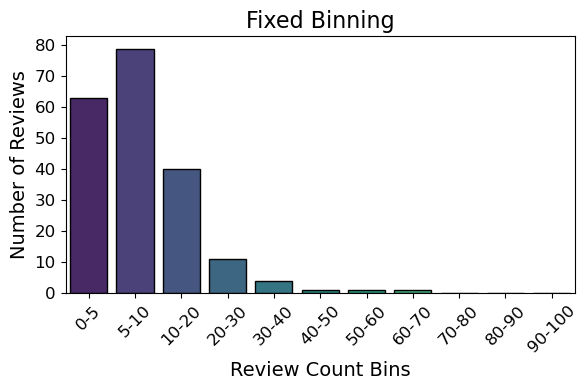

---

### Quantile Binning
In case of uneven data distribution, we can use an adaptive technique: quantile binning. This positions bins based on the distribution of the data, ensuring that each bin contains roughly the same number of data points. 

This prevents empty bins and maintains a balanced representation of the data.

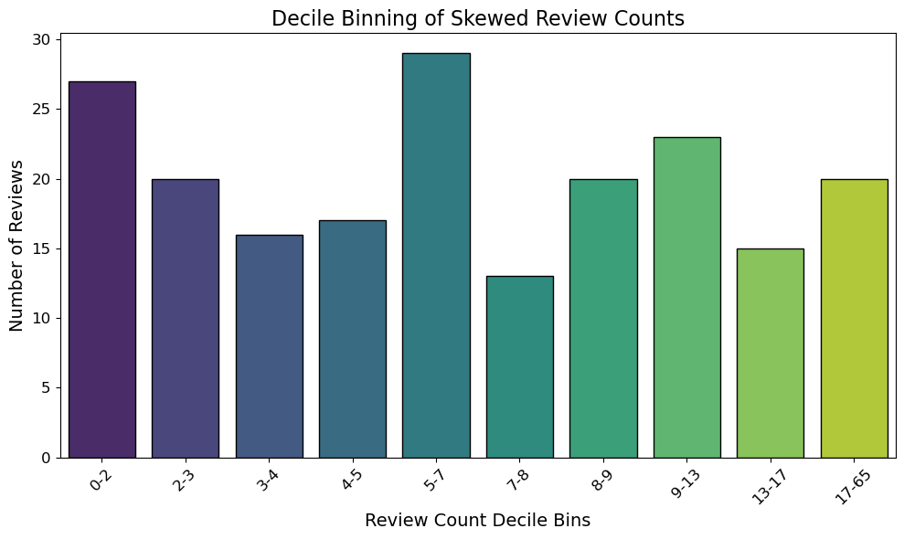

---

### Log Transformation

Another powerful technique for handling large ranges in counts is the logarithmic transform. The log function compresses the range of large numbers and expands smaller ones.

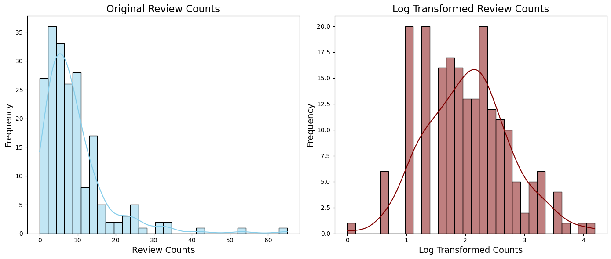

---

### Power Transforms

The log transform is a specific example of a family of transformations known as power transforms. 
In statistical terms, these are variance-stabilizing transformations. Power transforms change the distribution of the variable so that the variance is no longer dependent on the mean.

---

### Power Transforms

A simple generalization of both the square root transform and the log transform is known as the **Box-Cox transform**:

$$ 
X ^ {( \lambda ) } = \left \{
\begin{array}{l}
{ {
\frac{X  ^  \lambda  - 1 } \lambda 
 } \  \textrm{ for  }  \lambda \neq0, } \\
 { { \mathop{\rm log} } X \  \textrm{ for  }  \lambda = 0. } 
\end{array}
 \right .
$$

The power parameter is estimated by a graphical technique or by the *Maximum-likelihood method*.

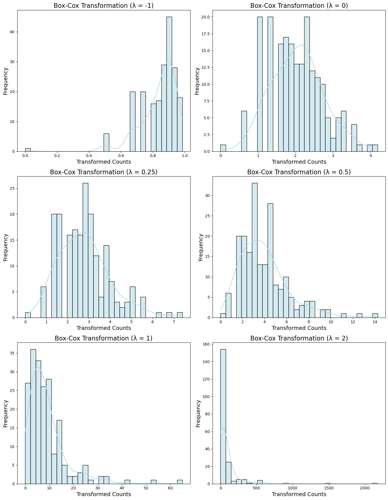

---

## Scaling

Feature scaling and normalization are crucial preprocessing steps in machine learning. Many algorithms, especially those based on distances or gradients, perform better when the input features are on comparable scales. Without proper scaling, features with larger ranges can disproportionately influence the model. 

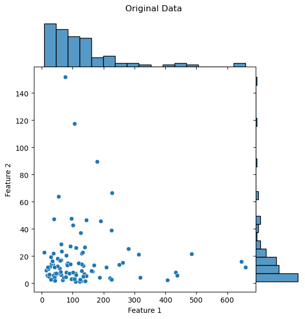

---

### Min-Max Scaling

Min-max scaling transforms the features to a fixed range, usually between 0 and 1. This is particularly useful for algorithms like k-nearest neighbors (KNN) and k-means clustering, which rely on distance metrics. However, it’s sensitive to outliers because extreme values can distort the scaling.

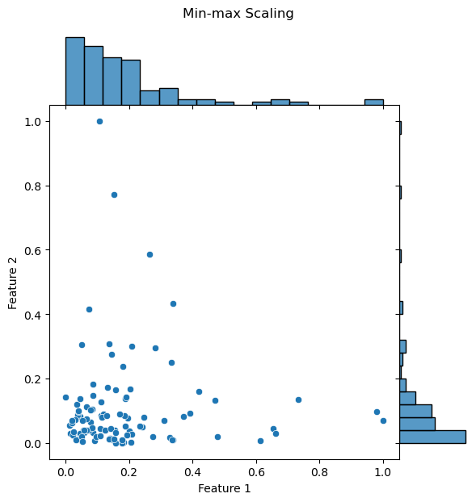

---

### Variance Scaling (Standardization)

Variance scaling (or standardization) transforms features so that they have a mean of 0 and a standard deviation of 1. This is useful for models like linear regression, logistic regression, and neural networks, where features are assumed to be normally distributed.


---

### $L_2$ Normalization

L2 normalization divides each feature vector by its Euclidean norm, so that the resulting vectors all have a length of 1. This is particularly useful in models like SVM or KNN, where the direction of vectors is more important than their magnitude.
L2 normalization ensures preserves the relative distances between points but ensures that no individual feature dominates due to its scale.

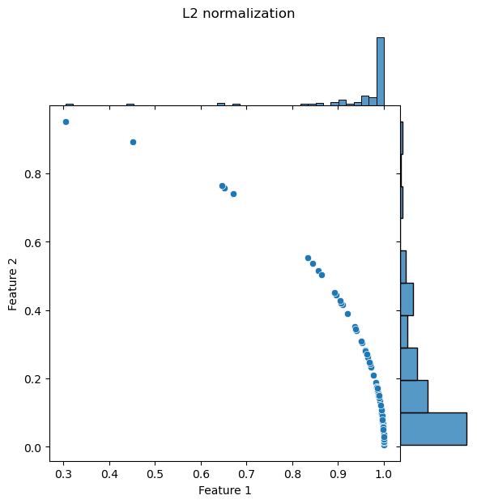

---

## Feature Selection
Feature selection techniques prune away nonuseful features in order to reduce the complexity of the resulting model. 

>Given a set of $d$ features, select a subset of size $m$ that leads to the smallest classification error.

The end goal is a parsimonious model that is quicker to compute, with little or no degradation in predictive accuracy. 

---

## Feature Selection

Feature selection is not about reducing training time but about **reducing model scoring time**.

Once $m$ has been decided (rule of thumb $N_{class}/m>10$) choose the $m$ most informative features keeping:
- Large distances between classes
- Small distances within class
---

## Feature Selection

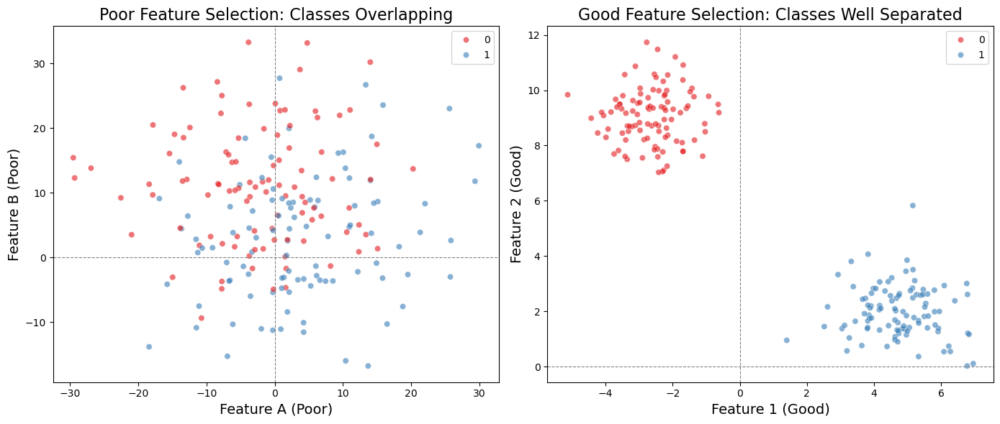


---
### Types of Feature Selection

Roughly speaking, feature selection techniques fall into four classes:

- **Filtering**
- **Unsupervised methods**
- **Wrapper methods**
- **Embedded methods**

---

## Code Example

- The data is already tidy and partitioned into training and testing csv files. 
- There are 2000 observations in the training set and 1000 in testing.
- Each observation consisits of 20 phone features (columns) and one categorical label (final column) describing the phone's price range.


---

### Filtering

Filtering techniques preprocess features to remove ones that are unlikely to be useful for the model. Filtering techniques are much cheaper than the wrapper techniques described next, but they do not take into account the model being employed. 

We can calculate the association of each feature with the outcome and select only those features that are significatly (p<.05) associated. 

```
'Prodigious Model Score: 0.914'
'Parsimonious Model Score: 0.915' # using only 7 features
```

---

### Unsupervised Methods
**Remove highly correlated features**: to remove the correlated features, we can make use of the `corr()` method of the pandas dataframe. 

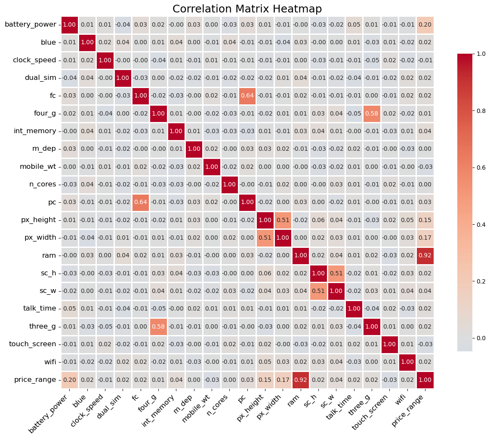

---

We can loop through all the columns in the correlation_matrix and keep track of the features with a correlation value > 0.5. This 0.5 cut-off is quite strict and chosen for demonstration purposes. 

```{python}
display(correlated_features)
{'fc', 'four_g', 'px_height', 'sc_h'}
```

These features are correlated to at least one other feature and can be considered redundant. Let's not include them in our parsimonious set and see how it effects model performance.

```
'Prodigious Model Score: 0.914' 
'Parsimonious Model Score: 0.904'
```

---

### Wrapper methods 

These techniques are expensive, but they won’t accidentally prune away features that are uninformative by themselves but useful when taken in combination.

>**Recursive feature elimination (RFE)** is a stepwise feature selection process.

```
'Prodigious Model Score: 0.914'
'Parsimonious Model Score: 0.914'
```

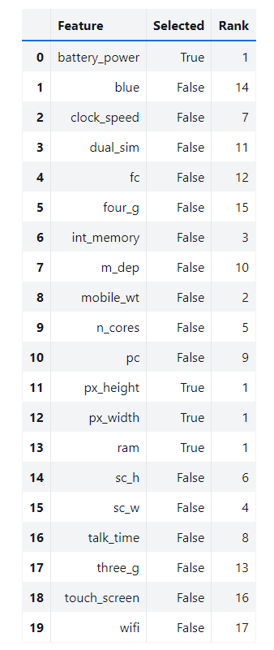

---
### Embedded methods

These methods perform feature selection as part of the model training process. For example, the $L_1$ regularizer, which can be added to the training objective of any linear model. 

They are not as powerful as wrapper methods, but they are nowhere near as expensive. Compared to filtering, embedded methods select features that are specific to the model. 

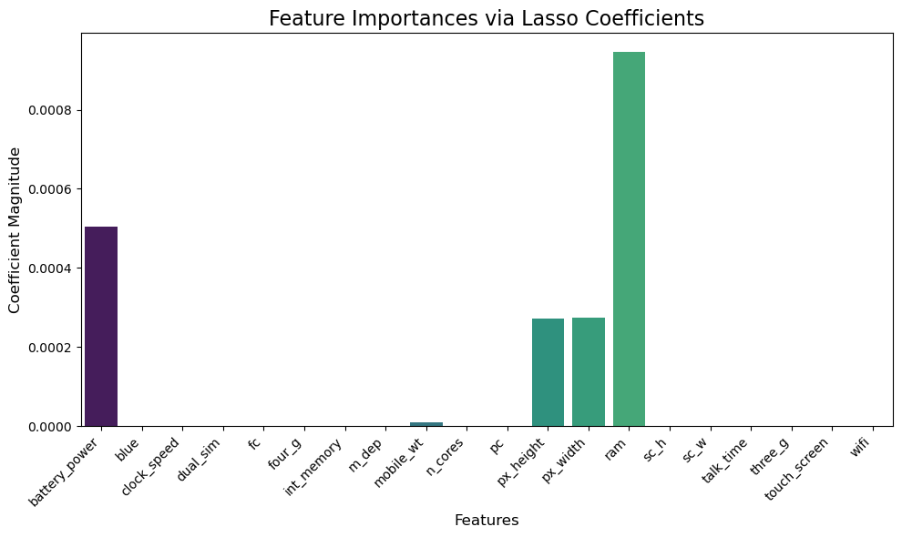