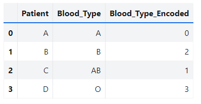
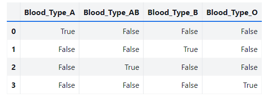
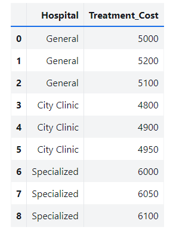
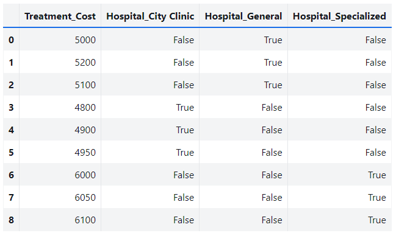
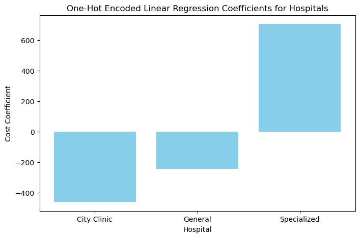
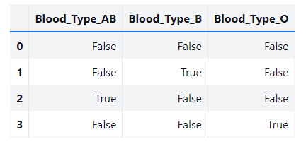
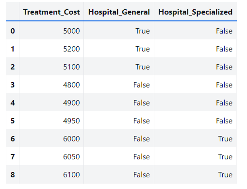
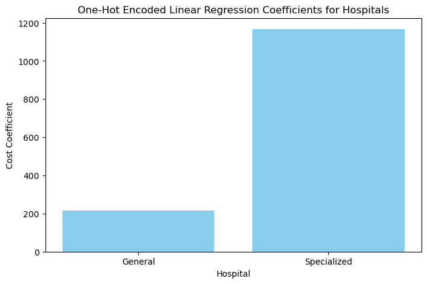
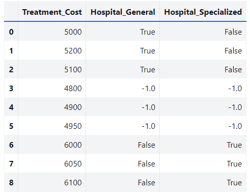
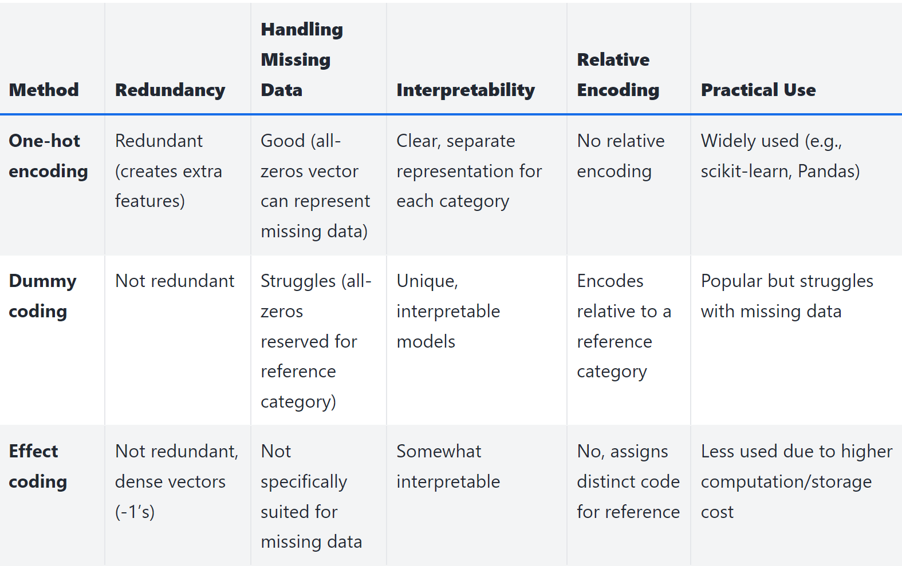

# **Feature Engineering**

##  Categorical Variables

---

## The Problem with Simple Integer Encoding

In a dataset containing categorical information like "Blood Type", it might seem reasonable to assign integer values: 



However, this simple encoding creates an unintended ordinal relationship between the categories. This can mislead machine learning models into making inaccurate assumptions about the data.

---

### One-Hot Encoding

One-hot encoding solves the problem of artificial ordering by creating binary (0/1) columns for each category. Each column represents a category, and a value of 1 indicates the presence of that category, while a 0 means absence. 



---

### One-Hot Encoding: example

Suppose we are trying to predict the average cost of treatment based on the hospital where the patient receives care. 
Let's consider that we have data from three hospitals: "General Hospital," "City Clinic," and "Specialized Care Center."

We can train a linear regressor to predict cost of treatment based solely on the identity of the hospital:

$$
y = w_1x_1 + \dots + w_nx_n + b
$$

---

### One-Hot Encoding: example






---

### One-Hot Encoding: example

```python
# Get the model coefficients and intercept
Coefficients: [-461.11111111 -244.44444444  705.55555556]
Intercept: 5344.444444444444
```



---

### Dummy Coding

Dummy encoding is similar to one-hot encoding, but it drops one of the categories to avoid collinearity. This is particularly useful when using linear models, where collinearity can lead to issues during training. The dropped category is represented by the vector of all zeros and acts as *reference category*. 



---

### Dummy Encoding: example



---

### Dummy Encoding: example

```python
# Get the model coefficients and intercept
Coefficients: [ 216.66666667 1166.66666667]
Intercept: 4883.333333333333
```



---

## Effect Coding

Effect coding is very similar to dummy coding, with the difference that the reference category is represented by the vector of all –1’s.

Thus, by regressing the effect-coded variables, we compare each level of a categorical variable to the overall (unweighted) mean rather than to a reference category. 

Effect coding can be used in experiments where the goal is to measure the effect of various treatments compared to the average effect across all treatments.

---
## Effect Coding



---
### Pros and Cons of Categorical Variable Encodings



---

## Dealing with Large Categorical Variables

When dealing with a large number of unique categories (e.g., thousands of different genetic markers), the encoding strategies mentioned earlier can result in:
- Increased memory consumption.
- Slower computations.
- Potential overfitting due to sparsity.

The challenge is to find a good feature representation that is memory efficient, yet produces accurate models that are fast to train. 

---

## Dealing with Large Categorical Variables

Generally, existing solutions can be reduecd to:

- Do nothing fancy with the encoding. Use a **simple model** that is cheap to train. Feed one-hot encoding into a linear model (logistic regression or linear support vector machine) on lots of machines.
- Compress the features. There are two choices:
    - **Feature hashing**, popular with linear models
    - **Bin counting**, popular with linear models as well as trees

---

### Feature Hashing

Feature hashing, also known as the hashing trick, is a technique where each category is hashed into a fixed number of bins. This approach allows for a more compact representation of large categorical variables, but it introduces a risk of collisions where different categories are hashed into the same bin.

$$
\phi_i(x) = \sum_{h(x)=i} \text{sign}(h(x))
$$

---

### Bin Counting

The concept of bin counting is straightforward yet powerful: instead of using the value of a categorical variable directly as a feature, we calculate the conditional probability of the target variable given that categorical value. 

This approach captures the association statistics between the categorical value and the target, assuming all features are independent.

---

### Bin Counting

As an example, bin counting can be when encoding the occurrence of various medical conditions in a hospital's records, bin counting allows rare diagnoses to be weighted more heavily, reflecting their unique medical significance. This method not only reduces dimensionality but also enhances the model’s ability to handle rare events, such as uncommon diseases, effectively.