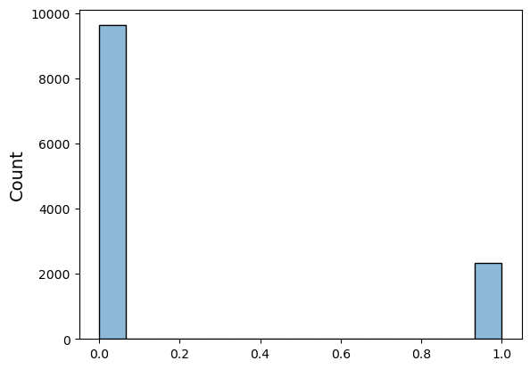
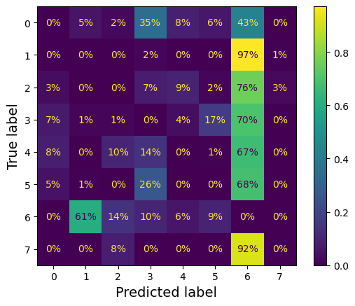

# **Feature Engineering**

## Classifiers

---

## Classification

Classification is the task of predicting categorical outcomes/labels


---

## MedMNIST

We will be using the MedMNIST datasets, which is a set of 18 Standardized Datasets for 2D and 3D Biomedical Image Classification.

Key Features:
- Diverse
- Standardized
- User-Friendly
- Educational
  
---

### 1. Look at the big picture.
### 2. Get the data.
### **3. Discover and visualize the data to gain insights.**
### 4. Prepare the data for Machine Learning algorithms.
### 5. Select a model and train it.
### 6. Fine-tune your model.

---

### BloodMNIST

Dataset BloodMNIST of size 28

**Data Modality**: Blood Cell Microscope
**Task**: Multi-Class (8)
**Number of Samples**: 17,092 (11,959 / 1,712 / 3,421)

Dataset of individual normal cells, captured from individuals without infection, hematologic or oncologic disease and free of any pharmacologic treatment at the moment of blood collection.

---
### BloodMNIST

**Meaning of labels**: 

0: *basophil*, 
1: *eosinophil*, 
2: *erythroblast*, 
3: *immature granulocytes*, 
4: *lymphocyte*, 
5: *monocyte*, 
6: *neutrophil*, 
7: *platelet*


---
### BloodMNIST

**Meaning of labels**: 

0: *basophil*, 
1: *eosinophil*, 
2: *erythroblast*, 
3: *immature granulocytes*, 
4: *lymphocyte*, 
5: *monocyte*, 
6: *neutrophil*, 
7: *platelet*


---

### 1. Look at the big picture.
### 2. Get the data.
### 3. Discover and visualize the data to gain insights.
### **4. Prepare the data for Machine Learning algorithms.**
### 5. Select a model and train it.
### 6. Fine-tune your model.

---
## Training a Binary Classifier

As an example of a binary classifier, we will try to identify one class: the number 6 (*neutrophil*).
So, we distinguish between just two classes, neutrophil and not-neutrophil (6 and not-6). 

```python
y_train_binary = (y_train == 6)  
y_test_binary = (y_test == 6)
```

---
## Training a Binary Classifier

To work with SGD we have to reshape the data to 2D: (n_samples, n_features)

```python
X_train = X_train.reshape(X_train.shape[0], -1)
X_test = X_test.reshape(X_test.shape[0], -1)
```

Let's normalize the data

```python
X_train = X_train / 255.0
X_test = X_test / 255.0
```

---

### 1. Look at the big picture.
### 2. Get the data.
### 3. Discover and visualize the data to gain insights.
### 4. Prepare the data for Machine Learning algorithms.
### **5. Select a model and train it.**
### 6. Fine-tune your model.

---

## Model Selection & Training

```python
from sklearn.linear_model import SGDClassifier

sgd_clf = SGDClassifier(random_state=42, max_iter=2000)
```

This estimator implements regularized linear models with **stochastic gradient descent** (SGD) learning: the gradient of the loss is estimated each sample at a time and the model is updated along the way with a decreasing learning rate.

```python
# Training
sgd_clf.fit(X_train, y_train_binary)
```

---

##  Gradient descent

Gradient Descent is an optimization algorithm used to minimize a function by iteratively moving in the direction of steepest descent as defined by the negative of the gradient. 


$$ 
\frac{\partial}{\partial \mathbf{\theta_j}} \mathrm{MSE}(\theta) = \frac{2}{m} \Sigma_{t=1}^m (\mathbf{\theta}^T \mathbf{x}^{(t)} - y^{(t)}) x_j^{(t)} 
$$ 

The gradient vector contains all the partial derivatives:

$$
\nabla_\theta \mathrm{MSE}(\mathbf{\theta})  =  \frac{2}{m} \mathbf{X}^T (\mathbf{X}\mathbf{\theta} - \mathbf{y})
$$

---

### Gradient descent step

Each step of the gradient descent is calculated as:
$$
\mathbf{\theta}^{(step+1)} = \mathbf{\theta}^{(step)} - \eta \nabla_\mathbf{\theta} \mathrm{MSE}(\mathbf{\theta}^{(step)})
$$

where the hyperparameter $\eta$ is called the **learning rate**.


---
## Stochastic Gradient Descent

**Stochastic Gradient Descent** (SGD) is a variation of Gradient Descent. 

Instead of using the entire dataset to compute the gradient at each step, SGD uses a single randomly selected sample. This makes it faster and able to handle large datasets, but the path to the minimum is noisier.

---


---
## Learning rate

The **learning rate** hyperparameter represents the size of the steps. This is important because if the learning rate is too small, then the algorithm will have to go through many iterations to converge, which will take a long time.

On the other hand, **if the learning rate is too high**, you might jump across the valley and end up on the other side, possibly even higher up than you were before. This might make the algorithm diverge.

---


---

## GD regression example


---
## GD regression example

Let's evaluate the GD:

```python
eta = 0.1  # learning rate
n_epochs = 1000
m = len(X_b)  # number of instances

np.random.seed(42)
theta = np.random.randn(2, 1)  # randomly initialized model parameters

for epoch in range(n_epochs):
    gradients = 2 / m * X_b.T @ (X_b @ theta - y)
    theta = theta - eta * gradients
```

---
## GD regression example


---
## GD with various learning rates (1000 epochs)


---

#### The Issue with GD

The main problem with (Batch) GD is the fact that it uses the whole training set to compute the gradients at every step, which makes it very slow when the training set is large. 

Instead, **SGD just picks a random instance** in the training set at every step and computes the gradients based only on that single instance. 

This makes the algorithm much faster and makes it possible to train on huge training sets, since only one instance needs to be in memory at each iteration.

---
## Learning Schedule

Randomness is *good* to escape from local optima, but *bad* because it means that the algorithm can never settle at the minimum. 

One solution is to gradually reduce the learning rate. The steps start out large (which helps make quick progress and escape local minima), then get smaller and smaller, allowing the algorithm to settle at the global minimum. 

The function that determines the learning rate at each iteration is called the **learning schedule**. 


---
## SGD with Learning Schedule (50 epochs)


---
## IID Instances
Note that since instances are picked randomly, some instances may be picked several times per epoch while others may not be picked at all.

When using Stochastic Gradient Descent, the training instances must be **independent and identically distributed** (IID), to ensure that the parameters get pulled towards the global optimum, on average. A simple way to ensure this is to shuffle the instances during training.

---


### 1. Look at the big picture.
### 2. Get the data.
### 3. Discover and visualize the data to gain insights.
### 4. Prepare the data for Machine Learning algorithms.
### 5. Select a model and train it.
### **6. Fine-tune your model.**

---

## Performance Measures

Evaluating a classifier is often significantly tricky.


**Cross-validation** allows to get not only an estimate of the performance of the model, but also a measure of the standard deviation. However, this comes at the cost of training the model several times, so it is not always possible.

```python
from sklearn.model_selection import cross_val_score

cross_val_score(sgd_clf, X_train, y_train_binary, cv=3, scoring="accuracy")

-> array([0.85502884, 0.84972403, 0.86402408])
```

---

## Pitfalls of Accuracy

The *accuracy* (ratio of correct predictions) is relatively high on all cross-validation folds.

However, let's compare it with the performance of a dummy classifier which always infers the most frequent class label in the observed `y` argument passed to `fit` (in this case `False`) . 

```python
cross_val_score(dummy_clf, X_train, y_train_binary, cv=3, scoring="accuracy")

-> array([0.80511663, 0.80531862, 0.80506774])
```

---




This is because only about 20% of the images are of class 6, so if you always guess that an image is not a 6, you will be right about 80% of the time.


>That's why accuracy is generally not the preferred performance measure for classifiers, especially when you are dealing with *skewed datasets* 

---

### Confusion Matrix

The general idea is to count the number of times instances of class A are classified as class B.

*A perfect classifier would have only true positives and true negatives, so its confusion matrix would be diagonal*

```python
from sklearn.metrics import confusion_matrix

cm = confusion_matrix(y_train_binary, y_train_pred)

-> array([[9160,  469],
          [1250, 1080]], dtype=int64)
```

---

## Precision

The confusion matrix gives a lot of information, but sometimes we may prefer a more concise metric. 

An interesting one to look at is the accuracy of the positive predictions; this is called the **precision** of the classifier:

$$ \mathrm{precision} = \frac{TP}{TP + FP} $$

TP is the number of true positives, and FP is the number of false positives.

---

## Recall

If we make one single positive prediction and ensure it is correct, we have perfect precision (precision = 1/1 = 100%). 
This would not be very useful so precision is typically used along with another metric named **recall**.

This is the ratio of positive instances that are correctly detected by the classifier:

$$
\mathrm{recall} = \frac{TP}{TP + FN} 
$$

---

## Precision & Recall of the Classifier

Now the classifier does not look as good as it did when we looked at its accuracy:

```python
from sklearn.metrics import precision_score, recall_score

precision_score(y_train_binary, y_train_pred) 

-> 0.697224015493867

recall_score(y_train_binary, y_train_pred)  

-> 0.463519313304721

```

---
## The $F_1$ score

It is often convenient to combine precision and recall into a single metric called the $F_1$ score, especially to compare two classifiers. 

The $F_1$ score is the harmonic mean of precision and recall:

$$
F_1 = \frac{2}{\frac{1}{\mathrm{precision}} + \frac{1}{\mathrm{recall}}}
$$

```python
f1_score(y_train_binary, y_train_pred)

-> 0.5568445475638051
```

---

### Precision/Recall Trade-off

The $F_1$ score favors classifiers that have similar precision and recall. 
Unfortunately, we can’t have it both ways: increasing precision reduces recall, and vice versa. 

This is called the *precision/recall tradeoff*.

To understand this tradeoff, let’s look at how the SGDClassifier makes its classification decisions. For each instance, it computes a score based on a **decision function**, and if that score is greater than a *threshold*, it assigns the instance to the positive class, or else it assigns it to the negative class.

---

#### Precision and recall as functions of the threshold value.


---

### Precision vs Recall


---

### The ROC Curve

The **receiver operating characteristic** (ROC) curve is another common tool used with binary classifiers. 

The ROC curve plots the **true positive rate** (TPR), i.e., *recall*, against the **false positive rate** (FPR), which is one minus the **true negative rate**.


---

### AUC

One way to compare classifiers is to measure the **area under the curve** (AUC). 

*A *perfect* classifier will have a ROC AUC equal to **1**, whereas a purely random classifier will have a ROC AUC equal to **0.5**.*

```python
from sklearn.metrics import roc_auc_score

roc_auc_score(y_train_binary, y_scores)

-> 0.83107930843745
```

---

## Multiclass Classification

Some algorithms (such as **Random Forest** classifiers) are capable of handling multiple classes directly. Others (such as **Linear** classifiers) are strictly binary classifiers. 

However, there are various strategies that we can use to perform multiclass classification using multiple binary classifiers:

- **One-versus-all** (OvA) strategy
- **One-versus-one** (OvO) strategy

---

## Error Analysis

Once we have a promising model, we want to find ways to improve it. 

One way to do this is to analyze the types of errors it makes.


---

## Error Analysis

It seems that our efforts should be spent on reducing the false 6s. 

- We could try to gather more training data for cells that look like neutrophils (but are not).
- We could engineer new features that would help the classifier.
- We could preprocess the images to make some patterns stand out.



---

## Error Analysis

Analyzing individual errors can also be a good way to gain insights on what our classifier is doing and why it is failing, but it is more difficult and time-consuming.

Let’s plot examples of 1s and 6s. 


---

## Multilabel Classification

In some cases we may want our classifier to output multiple classes for each instance.

For example, if we have trained a classifier to recognize three faces, for each picture we would like it to output multiple binary tags. This is called a **multilabel classification system**.

---

## Multioutput Classification

*Multioutput-multiclass classification* (or simply **multioutput classification**) is simply a generalization of multilabel classification where each label can be multiclass (i.e., it can have more than two possible values).


