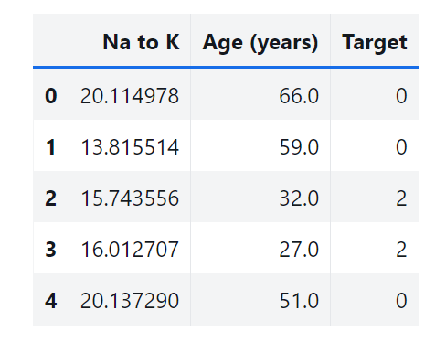

# **Feature Engineering**

## Decision Trees

---
  
# Decision Trees

**Decision Trees** are a powerful and versatile Machine Learning algorithm capable of performing classification, regression, and even multi-output tasks. They are especially well-suited for complex datasets, with minimal data preparation needed.

*One of the many qualities of Decision Trees do not require feature scaling or centering, making them ideal for a variety of real-world applications.*

---

## Training and Visualizing a Decision Tree

We'll use a simplified dataset where we measure two features (Sodium-Potassium ratio and age). Imagine that we are medical researchers and have collected data about a set of patients, all of whom suffered from the same illness. During their course of treatment, each patient responded to one of 3 medications: Drug A, Drug B, and C.

Let's build a model to find out which drug might be appropriate for a future patient with the same illness. 

---
## Training and Visualizing a Decision Tree

---
## Making Predictions

The **samples** attribute shows the number of training instances associated with the node. For example, at depth 1 (right), 52 instances have age less than 41.5 years.

---
## Making Predictions

The **value** attribute provides the number of training instances from each class within a node. For instance, the bottom-right node includes 1 Drug A, 2 Drug B, and 49 Drug C instances.

---
## Making Predictions

The **gini** attribute measures node impurity. A node is considered pure (gini = 0) when all instances belong to a single class.

---

## Making Predictions

**Gini impurity** is calculated as:

$$ G_i = 1 - \sum_{k=1}^{n} p_{i,k}^2 $$ 

where $p_{i,k}$ is the proportion of class $k$ instances within the $i^{th}$ node.

---

### Visualizing Decision Boundaries
If we plot the Decision Tree's decision boundaries, we can see how the model makes decisions based on patient sodium-potassium ratio and age.

---

### Visualizing Decision Boundaries

---

### Visualizing Decision Boundaries

The two depth-1 nodes would each add another decision boundary.

---
### Classification And Regression Tree (CART) 

Scikit-Learn uses the **CART** algorithm, which produces only binary
trees: nonleaf nodes always have two children (i.e., questions only
have yes/no answers). 

(However, other algorithms such as **ID3** can produce Decision Trees with nodes that have more than two children.)

---

###  Classification And Regression Tree (CART) 

The algorithm first splits the training set in two subsets using a single feature $k$ and a threshold $t_k$. To do this, it searches for the pair $(k, t_k)$ that produces the purest subsets. 

Once it has successfully split the training set in two, it splits the subsets using the same logic, then the sub-subsets and so on, recursively.  

**CART** cost function for classification

$$
J(k,t_k) = \frac{m_{\mathrm{left}}}{m} G_{\mathrm{left}} + \frac{m_{\mathrm{right}}}{m} G_{\mathrm{right}}
$$

---

### Regularization Hyperparameters

Decision Trees make very few assumptions about the training data (as opposed to linear models, which obviously assume that the data is linear, for example).

If left unconstrained, the tree structure will adapt itself to the training data, fitting it very closely, and most likely overfitting it. Such a model is often called a *nonparametric* model, not because it does not have any parameters (it often has a lot) but because the number of parameters is not determined prior to training, so the model structure is free to stick closely to the data. 

---

### Regularization Hyperparameters

In contrast, a *parametric* model such as a linear model has a predetermined number of parameters, so its degree of freedom is limited, reducing the risk of overfitting (but increasing the risk of underfitting).

The regularization hyperparameters depend on the algorithm used, but generally we can at least restrict the maximum depth of the Decision Tree. In `Scikit-Learn`, reducing `max_depth` hyperparameter will regularize the model and thus reduce the risk of overfitting.

---

### Regularization Hyperparameters

- `min_samples_split`: the minimum number of samples a node must have before it can be split, 
- `min_samples_leaf`: the minimum number of samples a leaf node must have,
- `min_weight_fraction_leaf`: same as `min_samples_leaf` but expressed as a fraction of the total number of weighted instances, 
- `max_leaf_nodes`: maximum number of leaf nodes, 
- `max_features`: maximum number of features that are evaluated for splitting at each node. 

---

---

## Instability

Decision Trees are simple to understand and interpret, easy to use, versatile, and powerful.

However they do have a few limitations. 

---
### Decision Trees Have High Variance

The main issue with Decision Trees is that they have quite a high variance: 

*Small changes to the hyperparameters or to the data may produce very different models.*

Indeed, the training the same model on the same data may produce a very different model every time, since the CART training algorithm used by `Scikit-Learn` is stochastic. 

---
### Sensitivity to axis orientation

Decision Trees love orthogonal decision boundaries.
So, rotating the dataset also leads to different decision boundaries:

