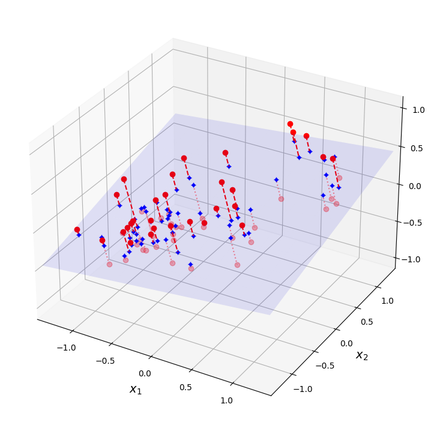
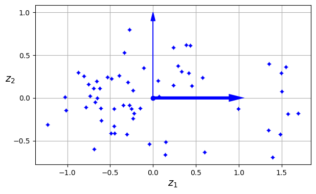
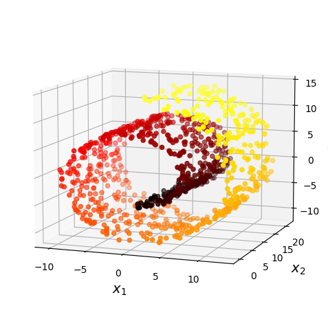
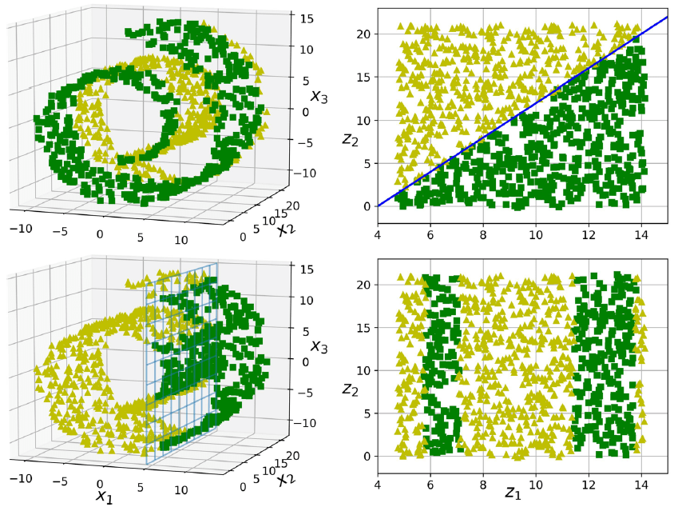
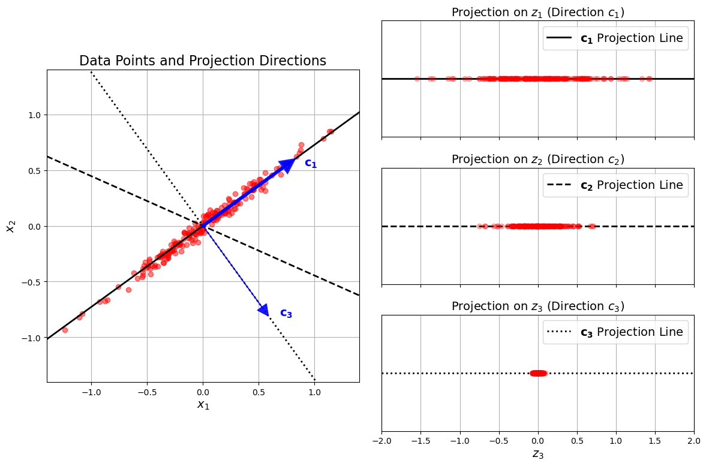
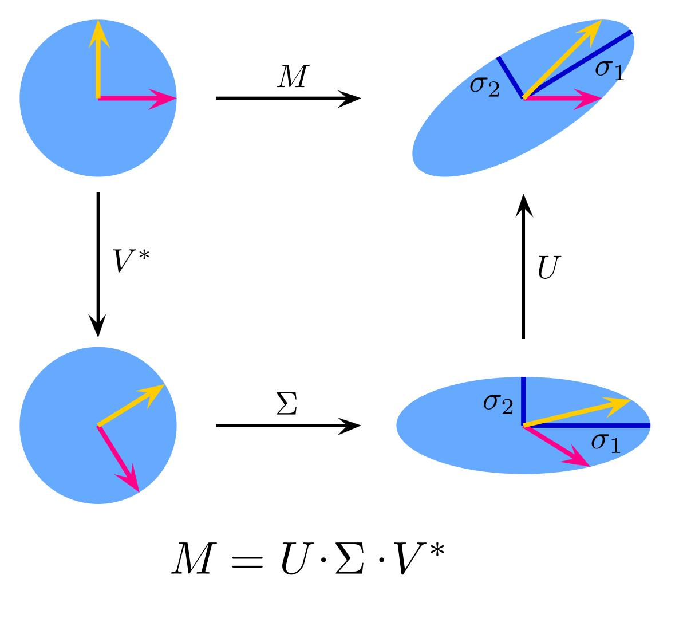
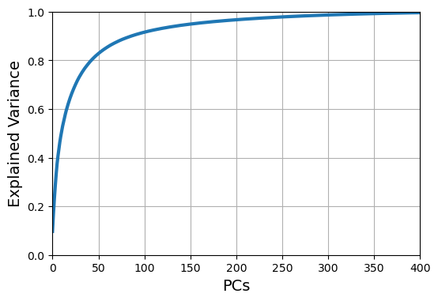
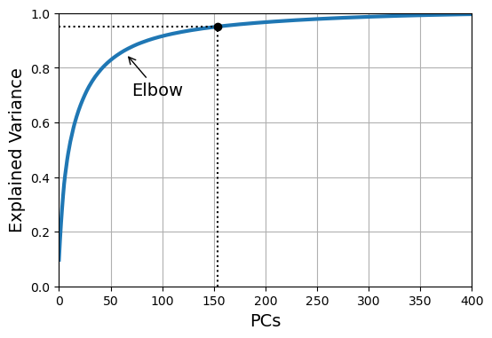
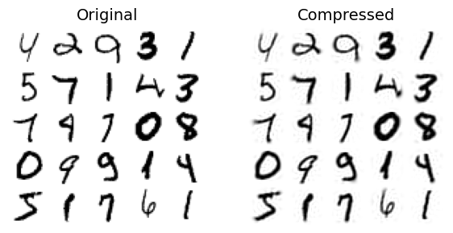

# **Feature Engineering**

## Dimensionality Reduction

---

## The Curse of Dimensionality
A large number of features is not always useful. Not only does this make training extremely slow, it can also make it much harder to find a good solution. This problem is often referred to as the *curse of dimensionality*.

We discussed filtering and feature scaling as ways of pruning away uninformative features. Now we will take a close look at feature dimensionality reduction using **principal component analysis** (PCA).


---

## Main Approaches for Dimensionality Reduction

Before we dive into specific dimensionality reduction algorithms, let’s take a look at the two main approaches to reducing dimensionality:

- Projection
- Manifold Learning

---

### Projection

In most real-world problems, training instances are not spread out uniformly across all dimensions.

As a result, all training instances actually lie within (or close to) a much lower-dimensional subspace of the high-dimensional space.



---

### Projection

In most real-world problems, training instances are not spread out uniformly across all dimensions.

As a result, all training instances actually lie within (or close to) a much lower-dimensional subspace of the high-dimensional space.



---
### Projection

However, projection is not always the best approach to dimensionality reduction. 
In many cases the subspace may twist and turn, such as in the famous *Swiss roll* toy dataset.



---
### Manifold Learning

A 2D manifold is a 2D shape that can be bent and twisted in a higher-dimensional space. More generally, a $d$-dimensional manifold is a part of an $n$-dimensional space (where $d < n$) that locally resembles a $d$-dimensional hyperplane. 

In the case of the Swiss roll, $d = 2$ and $n = 3$: **it locally resembles a 2D plane**, but it is rolled in the third dimension.

---
### Manifold Learning

Many dimensionality reduction algorithms work by modeling the manifold on which the training instances lie; this is called **Manifold Learning**. 

This relies on the *manifold assumption*, which holds that most real-world high-dimensional datasets lie close to a much lower-dimensional manifold. 

This assumption is very often empirically observed.

---
### Manifold Learning

The manifold assumption is often accompanied by the implicit assumption that
the task at hand will be simpler if expressed in the lower-dimensional space of the manifold.

However, this assumption does not always hold.




---
### Manifold Learning

In short, if you reduce the dimensionality of your training set before training a model, it will usually speed up training, but it may not always lead to a better or simpler solution; it all depends on the dataset.


---

## PCA

PCA is by far the most popular dimensionality reduction algorithm and focuses on the notion of linear dependency. 

Linearly dependent features are a waste of space and computation power because the information could have been encoded in
much fewer features.

The key idea here is to replace redundant features with a few new features that adequately summarize information contained in the original feature space. 

---

### Preserving the Variance

One way to mathematically define “adequately summarize information” is to say that before you can project the training set onto a lower-dimensional hyperplane, you first need to choose the right hyperplane, i.e., the one that will most likely lose less information.

To do this, we can maximize the average distance between pairs of points, or equivalently, the average distance between each point and its mean, which is the variance. 

---

### Preserving the Variance



---

### Principal Components

PCA identifies the axis that accounts for the largest amount of variance in the training set. It also finds a second axis, orthogonal to the first one, that accounts for the largest amount of remaining variance. 

*The unit vector that defines the *i*th axis is called the $i$-th principal component (PC).*


---

### Singular Value Decomposition

SVD is a standard matrix factorization technique that can decompose the training set matrix $X$ into the matrix multiplication of three matrices $U$, $\Sigma$, and $V^T$. where $V$ contains all the principal components that we are looking for:
 $$ V = \Bigg( c_1 \; c_2 \; \dots \; c_n \Bigg) $$

$U$ and $V$ are orthogonal matrices (i.e., $U^TU = I$ and $V^TV = I$). $\Sigma$ is a diagonal matrix containing the singular values of $X$, which can be positive, zero, or negative. 

---
### Singular Value Decomposition

In principle, the SVD factorization algorithm returns three matrices, $U$, $\Sigma$ and $V$, where $U$ is an $m\times m$ matrix, $\Sigma$ is an $m\times n$ matrix, and $V$ is an $n\times n$ matrix. 

However, the `svd()` function returns $U$, $s$ and $V^T$ instead. $s$ is the vector containing all the values on the main diagonal of the top $n$ rows of $\Sigma$. 

---
### Singular Value Decomposition




---
# Projecting Down to $k$ Dimensions

Once you have identified all the principal components, you can reduce the dimensionality of the dataset down to $k$ dimensions by projecting it onto the hyperplane defined by the first $k$ principal components. 

Selecting this hyperplane ensures that the projection will preserve as much variance as possible.

---
# Projecting Down to $k$ Dimensions

To project the training set onto the hyperplane, you can simply compute the matrix multiplication of the training set matrix $X$ by the matrix $V_k$, defined as the matrix containing the first $k$ principal components (i.e., the matrix composed of the first $k$ columns of V)

$$
Z = X V_k = U\Sigma{}V^TV_k = U_k \Sigma_k
$$

---

### PCA Implementation: Summary 

1. Center the Data Matrix
1. Compute the SVD
1. Find Principal Components
1. Transform the Data

---

### Using Scikit-Learn

With Scikit-Learn, PCA is really trivial:

```python
from sklearn.decomposition import PCA

pca = PCA(n_components=2)
X2D = pca.fit_transform(X)
pca.components_
``` 

But how many principal components ($k$) to use? 

One possibility is to pick $k$ to account for a desired proportion of total variance. 

---
#### Selecting $k$ based on accounted variance

The variance of the projection onto the *k*th component (also termed **explained variance ratio**) is:
$$
|| X\mathbf{v_k} ||^2 = ||\mathbf{u_k}\sigma_k||^2 = \sigma_k^2
$$


```python
pca.explained_variance_ratio_
-> array([0.7578477 , 0.15186921])
```

The first dimension explains about 76% of the variance, while the second explains about 15%.

---
#### Selecting $k$ based on accounted variance

To determine how many components to use, one can perform a simple analysis of the data matrix and pick the threshold that retains enough variance.
So, to  cover 80% of the total variance in the data, pick $k$ such that:

$$ \frac{\Sigma_{i=1}^k \sigma_i^2}{\Sigma_{i=1}^d \sigma_i^2} \ge 0.8 $$

```python
# The number of components is automatically chosen to account for 
# at least 80% of the total variance.
pca_transformer = PCA(n_components=0.8)
```

---
## PCA for Compression

Next, we will see how PCA can be used for data compression by applying it to a higher resolution version of the MNIST dataset.

Obviously after dimensionality reduction, the training set takes up much less space.

---
## PCA for Compression



---
## PCA for Compression



---
## PCA for Compression



```
Original size (pixels): 44.86 MB
Compressed size (components): 8.81 MB
```

---

### Limitations of PCA

- Uninterpretable outcome
- High computational cost
- Difficult to perform in a streaming fashion, in batch updates, or from a sample of the full data.
- Sensitive to the presence of outliers