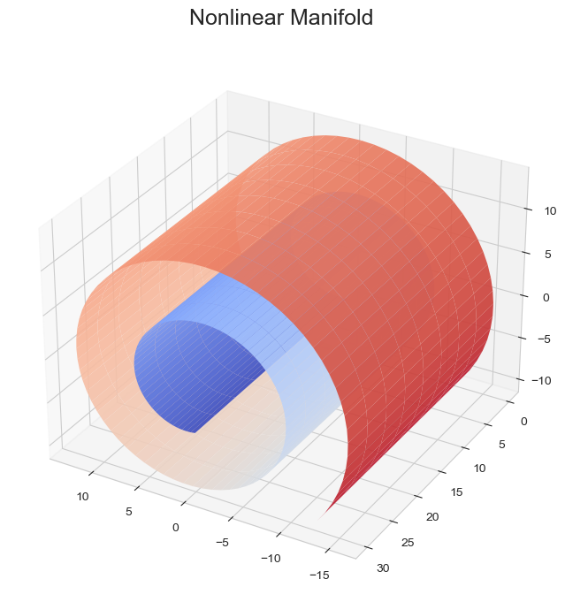
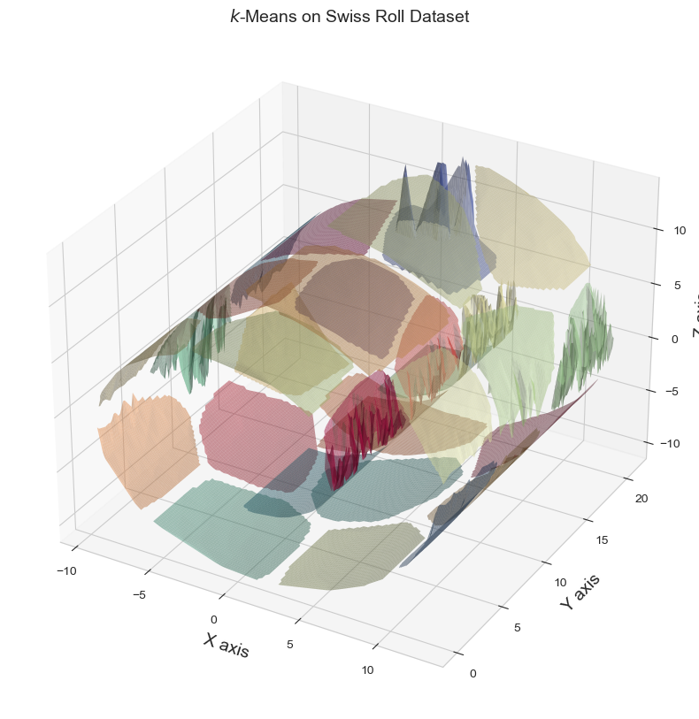
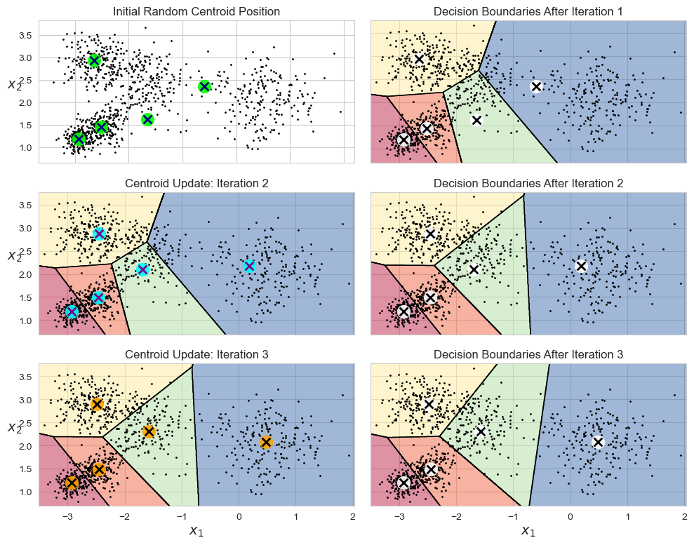
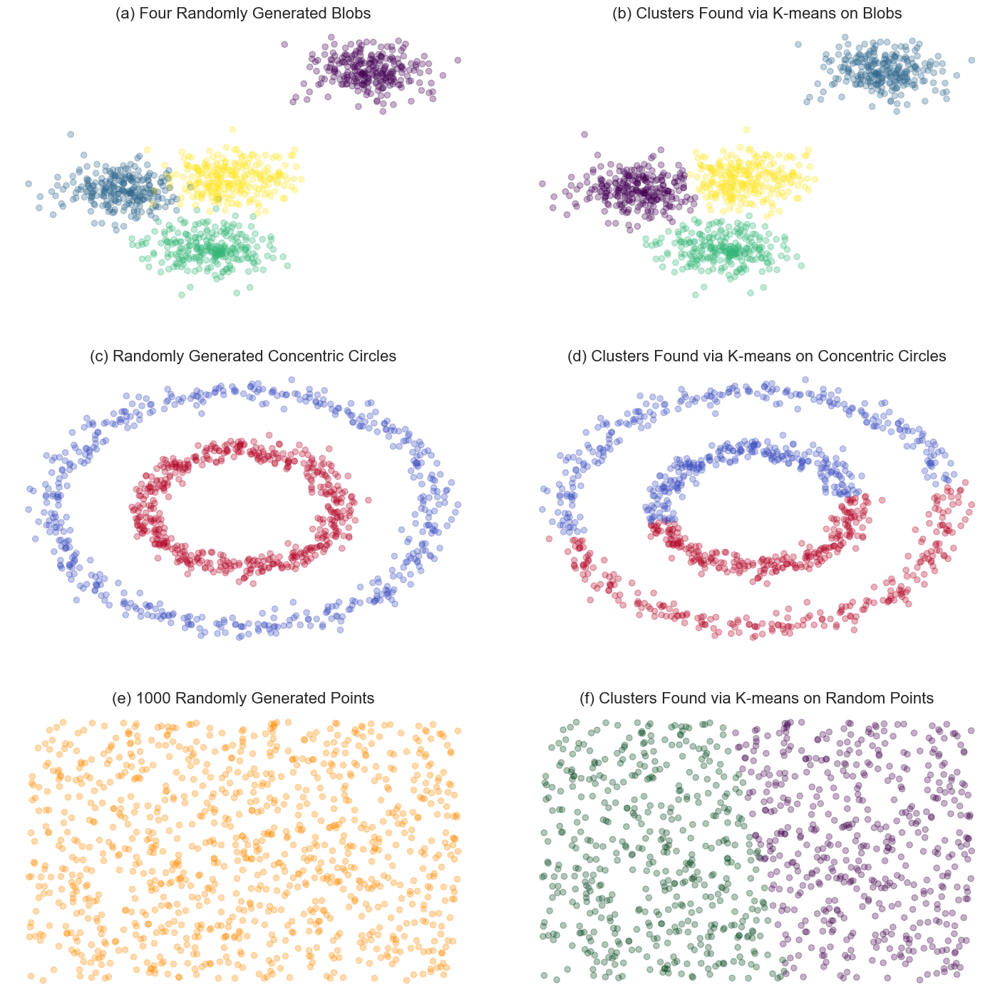
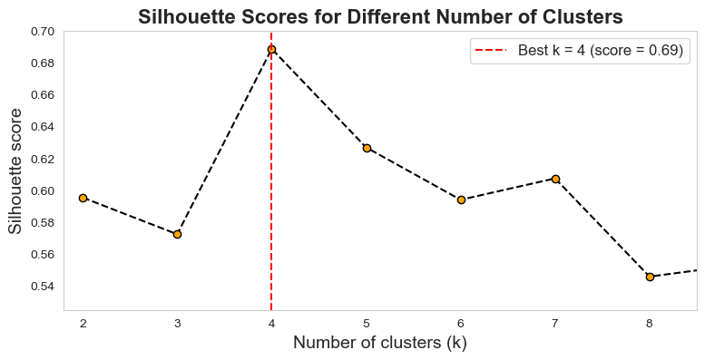
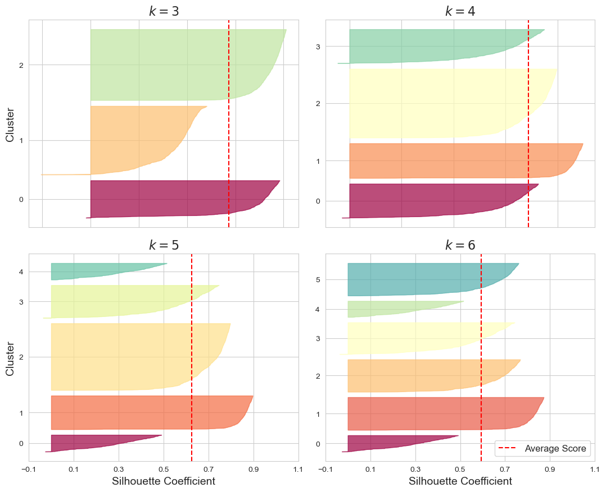
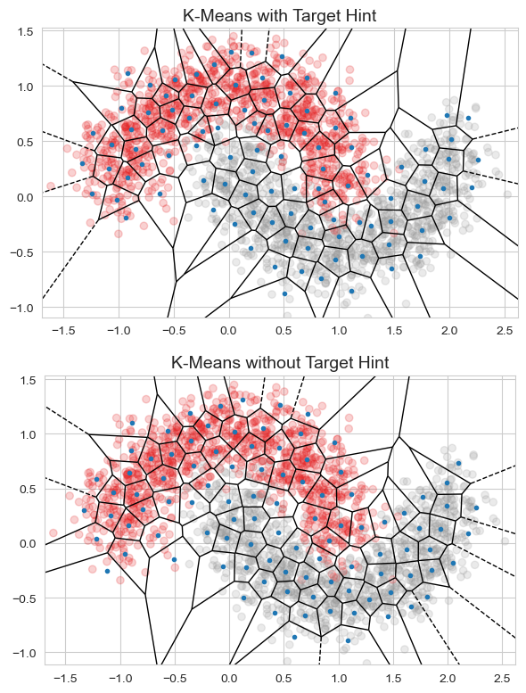
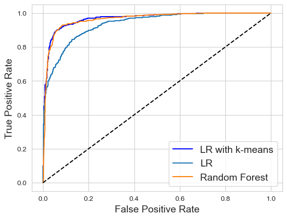
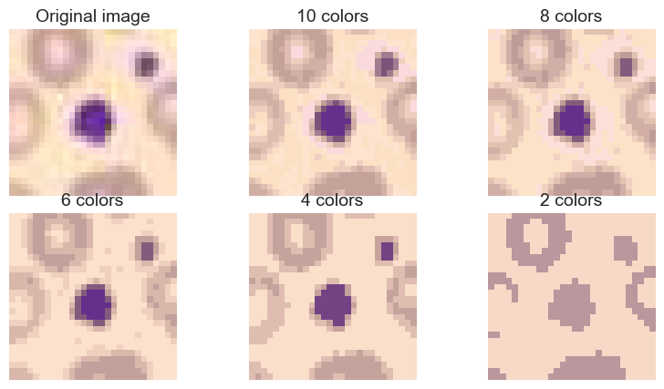

# **Feature Engineering**

## Nonlinear Manifold Feature Extraction

---

### Nonlinear manifolds

PCA is very useful when the data lies in a linear subspace, but what if the data forms a more complicated shape?

If a linear subspace is a flat sheet of paper, then a rolled up sheet of paper is a simple example of a **nonlinear manifold**.

---
### Nonlinear manifolds

If we could somehow unroll the Swiss roll, we’d recover the 2D plane. This is the goal of **nonlinear dimensionality reduction**, which assumes that the manifold is simpler than the full dimension it occupies and attempts to unfold it.

---
### Nonlinear manifolds

The key observation is that even when a big manifold looks complicated, *the local neighborhood around each point can often be well approximated with a patch of flat surface*.

---
### Nonlinear manifolds

Clustering algorithms can be seen as techniques for **local structure learning**. Points that are close to each other (where “closeness” can be defined by a chosen metric) belong to the same cluster. 

If the number of clusters is smaller than the number of features, then *the original data is compressed into a lower dimension*.

---

## k-Means Clustering

k-means is a clustering algorithm. Clustering algorithms group are **unsupervised** in that they do not require any sort of label: the algorithm’s job is to infer cluster labels based solely on the geometry of the data itself.

A clustering algorithm depends on a metric. The most popular metric is the *Euclidean distance*.

$$
|| x - y ||_2
$$

---

## k-Means Clustering

k-means establishes a hard clustering (one and only one cluster for each data point). The algorithm minimizes the total sum of the Euclidean distance between each data point and its cluster.

$$
\mathrm{min}_{C_1,\dots,C_k,\mu_1,\dots,\mu_k} \sum_{i=1}^{k} \sum_{x \in C_i} || x - \mu_i ||_2
$$

Each cluster $C_i$ contains a subset of data points and its center is:
$$ \mu_i = \sum_{x \in C_i} x/n_i  $$

---
### The K-Means Algorithm

* First initialize $k$ centroids randomly.
* Repeat until convergence:
    * Assign each instance to the closest centroid.
    * Update the centroids to be the mean of the instances that are assigned to them.

---
### Finding the Optimal Number of Clusters

Common applications of clustering assume that there are natural clusters to be found.

However, when data is spread out fairly uniformly, there is no longer a correct number of clusters.

---

### Finding the Optimal Number of Clusters

A rather precise approach (but also more computationally expensive) is to use the **silhouette score**.

An instance’s *silhouette coefficient* is equal to $(b – a) / \mathrm{max}(a, b)$, where: 
- $a$ is the mean distance to the other instances in the same cluster (it is the mean intra-cluster distance), 
- $b$ is the mean nearest-cluster distance, that is the mean distance to the instances of the next closest cluster. 

---

### Finding the Optimal Number of Clusters

---

### Silhouette Diagram

---

### k-Means Featurization for Classification

k-means featurization creates a compressed spatial index of the data which can be fed into the model in the next stage.  This is an example of **model stacking**.

When using k-means as a featurization procedure, a data point can be represented by its cluster membership (a sparse one-hot encoding of the cluster membership categorical variable).

---

### k-Means Featurization for Classification

If a target variable is also available, then we have the choice of giving that information as a hint to the clustering procedure.

---
### Classification with KMeans clustering features

The plot shows that logistic regression performs much better with cluster features than without. In fact, with cluster features, the linear classifier performs just as well as nonlinear classifiers.

This is a interesting result because linear classifiers are much cheaper to train than nonlinear classifiers. 

---

### Clustering for Unsupervised Learning

