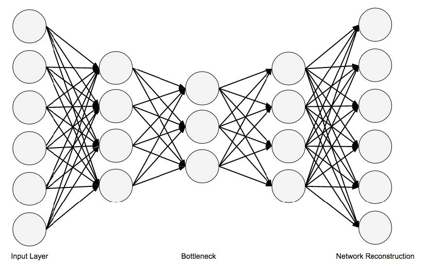

# **Deep Learning**

## Major Architectures of Deep Networks

---

### **Introduction to Network Architectures**
- To generate data (e.g., images, audio, or text):
  - GANs
  - VAEs
  - Recurrent Neural Networks
- To model images:
  - CNNs
  - DBNs
- To model sequence data:
  - Recurrent Neural Networks/LSTMs

---

### **Autoencoders**

Autoencoders learn to encode data into a smaller dimensionality (latent space) and then decode it back to its original form.

---

### **Autoencoders**

- Comprised of two main components:
  - **Encoder**: Compresses input into a lower-dimensional representation.
  - **Decoder**: Reconstructs the original input from the encoded representation.
  
  

---

### **Variational Autoencoder (VAE)**
Adds stochastic properties for more robust feature extraction.

---

###  **Deep Belief Networks (DBNs)**
- **Components**:
  - Stacked Restricted Boltzmann Machines (RBMs).
  - Fine-tuning phase with supervised learning.

---

###  **Deep Belief Networks (DBNs)**
- **Purpose**:
  - DBNs use unsupervised layers to capture high-level data features before applying a classifier.
  
 
 
 
 
---

### **Generative Adversarial Networks (GANs)**
They are composed of a **Generator** and **Discriminator** network. During training the generator tries to produce realistic data while the discriminator distinguishes between real and fake data.

Produces high-quality, realistic images; often used in medical image synthesis for enhancing datasets.

---

### **Diffusion Models**
- **Definition**: Probabilistic models that generate data by reversing a diffusion process.
- **How It Works**:
  - Starts with Gaussian noise and gradually refines it to generate samples.
  - Trained by simulating and then reversing a gradual noising process.
- **Applications in Biomedical Engineering**:
  - Medical image synthesis and enhancement.
  - Denoising of medical scans, improving quality and interpretability.
- **Examples**:
  - **Denoising Diffusion Probabilistic Models (DDPMs)** used in MRI reconstruction to remove noise from scans.
  
---

### **Normalizing Flows**
- **Definition**: Models that learn complex data distributions by transforming simple probability distributions through a series of invertible mappings.
- **Key Components**:
  - **Bijective Transformation**: Ensures data can be transformed back to original space.
  - **Likelihood Maximization**: Direct computation of probability densities.
- **Applications in Biomedical Engineering**:
  - **Data Generation**: Create realistic variations of biomedical data for model training.
  - **Anomaly Detection**: Identify outliers in medical datasets (e.g., rare disease detection).
- **Popular Examples**:
  - **Real NVP**: Used for high-quality image synthesis.
  - **Glow**: Applied in medical imaging tasks to improve anomaly detection.

---

### **Transformers**
- **Definition**: A deep learning model using attention mechanisms to capture long-range dependencies in data.
- **Core Mechanism**: **Self-Attention** allows each data point to attend to all others, capturing relationships regardless of their position.
- **Advantages**:
  - No sequential constraints like RNNs; can handle long-range dependencies more effectively.

---

### **Mamba Models**
- **Definition**: Mamba models refer to modular, adaptive, and multi-branch architectures often applied in complex biomedical imaging tasks.
- **Structure**:
  - Typically involve multiple interconnected branches that process different parts or aspects of an image.

---

### **Convolutional Neural Networks (CNNs)**
They are designed primarily for image processing tasks.

**Core Components**:
  - **Convolution Layers**: Extract spatial features.
  - **Pooling Layers**: Downsample feature maps to reduce dimensionality and control overfitting.
  - **Fully Connected Layers**: Often used for final classification .
  
---

### **Applications of CNNs in Biomedical Engineering**

- **Medical Image Analysis**: Detection of diseases in CT, MRI, and X-ray images.
- **Genomics**: Pattern recognition in genomic data.
- **Challenges**:
  - Training requires large labeled datasets, high computational power.
- **Popular CNN Architectures**:
  - **LeNet, AlexNet, VGG, ResNet**: Each addresses challenges like computation or overfitting  .

---

### **nnUNet**
nnUNet is an out-of-the-box 3D medical image segmentation framework that automates model configuration and optimization.
  - **Self-Configuration**: Adapts network architecture, hyperparameters, and training schemes to the dataset.
  - **Ensemble Learning**: Combines predictions from multiple models for more robust results.

nnUNet was the top-performing model on the **Medical Segmentation Decathlon**, excelling across diverse datasets. It has become the standard in biomedical imaging segmentation due to its adaptability.

---
### **Recurrent Neural Networks (RNNs)**
They model sequential data where time dependency matters.
- **Key Components**:
  - **Hidden State**: Maintains context across time steps.
  - **Types**: Vanilla RNNs, Long Short-Term Memory (LSTM), and Gated Recurrent Units (GRUs).

---

### **Recursive Neural Networks**
- **Definition**: Networks with a tree-like structure to capture hierarchical data.
- **Applications**:
  - Natural Language Processing (NLP) and image scene decomposition.
  - In biomedical contexts, used for parsing complex structures in genomic sequences or biological images.
- **Advantages**:
  - Handles structured data and hierarchical relationships  .

---

### **Future Directions**
- **Model Personalization**: Tailoring deep networks to individual patient data.
- **Integration of Multi-Modal Data**: Combining imaging, genomics, and EHR data.
- **Ethics and Fairness**: Ensuring AI fairness and reducing biases in healthcare applications.
- **Emerging Architectures**:
  - Hybrid models combining CNNs, RNNs, and attention mechanisms for richer modeling.

